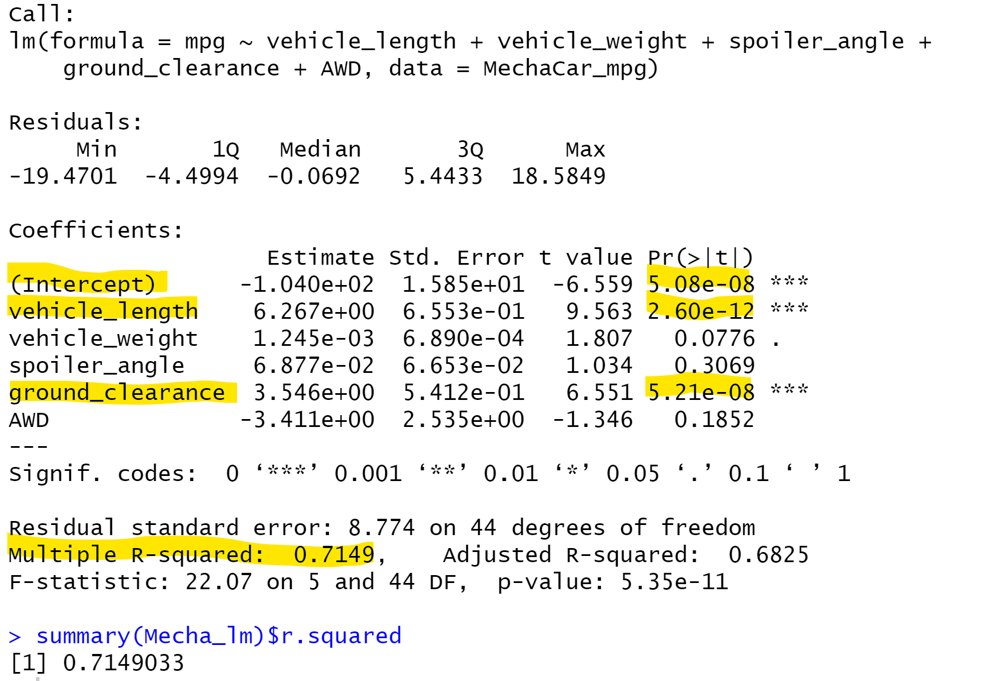
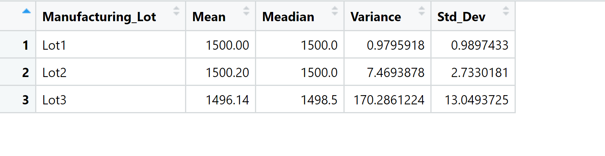
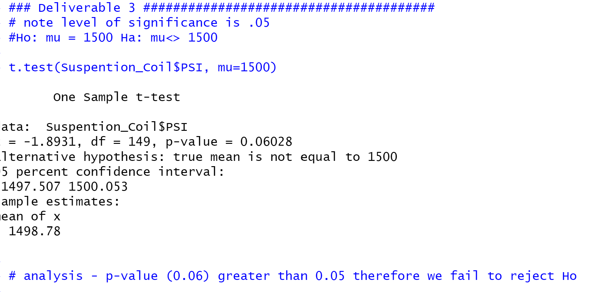
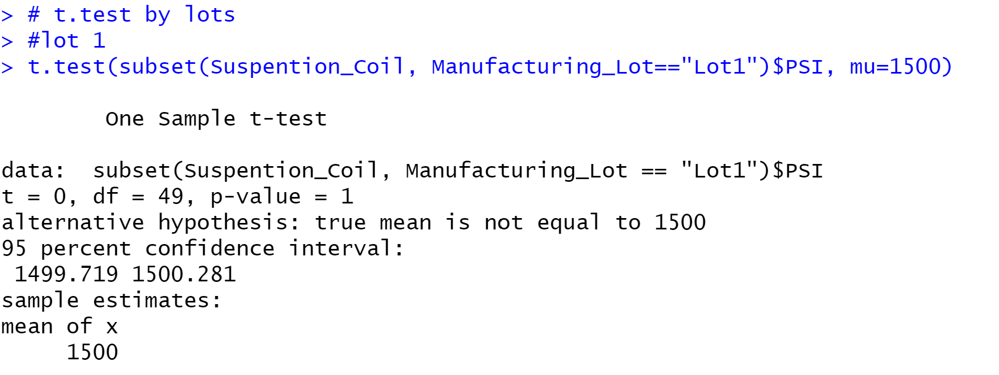
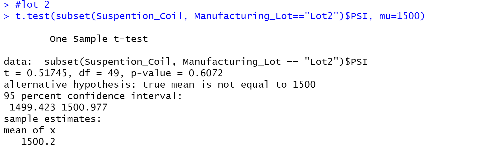
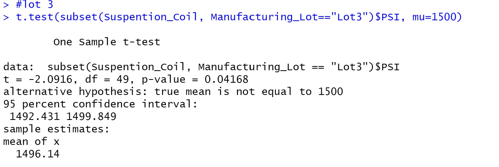

# MechaCar_Statistical_Analysis

## Background Info
A few weeks after starting his new role, Jeremy is approached by upper management about a special project. AutosRUs’ newest prototype, the MechaCar, is suffering from production troubles that are blocking the manufacturing team’s progress. AutosRUs’ upper management has called on Jeremy and the data analytics team to review the production data for insights that may help the manufacturing team.

**1. Deliverable 1: Linear Regression to Predict MPG:**

- Perform multiple linear regression analysis to identify which variables in the dataset predict the mpg of MechaCar prototypes

- Q1. Which variable/ Coefficents provided a non-random amount of variance to the mpg values in the Dataset?
- Methodology:Each PR(.|t|) value in the summary (Above) represents the proability that each coefficient contibutes a ramdom amount of variance to the linear model.
- A1. Using the MechaCar_mpg dataset, vehcicle_length and Ground_clearance (as well as the itercept)are statistically unlikely to provide random amount of variance to the linear model. In other words the **vehcicle_length and Ground_clearance have a significant impact on mpg**

- Q2. Is the slope of the linear model considered to be zero? Why or why not?
- Methodology:Each PR(.|t|) value in the summary (Above) for the intercept. 
- - A2. **The intercept is statistically significant** (less than the .05) **and not Zero**. This would indicate that the intercept term explains a significant amount of variability when all independent variaibles are equal to zero. It could mean that the sigificant features (such as vehcicle_wieight and ground_ clearance) may need scxaling or transforming to help improve the predictive power of the model; or there are other variable (mpg) that have not been included in our model.

- Q3. Does this linear model predict mpg of MechaCar prototypes effectively? Why or why not?
- Methodology:Examine the multiple R-squared value to inicate how well the regressipon madel approximates real_world data points. In most cases, the vaulue will range between 0 and 1 and can be used as a probility metric to determine the likelihood that future data points will fit the model.
- A3. The **Multiple R_squared value is 0.71** (while the p_value remained significant (very small)) **indicating the model does an adequate job of predicting mpg.**

**2. Deliverable 2: Summary Statistics on Suspention Coils:**

- Collect summary statistics on the pounds per square inch (PSI) of the suspension coils from the manufacturing lots

- Q1.The design specifications for the MechaCar suspension coils dictate that the variance of the suspension coils must not exceed 100 pounds per square inch. Does the current manufacturing data meet this design specification for all manufacturing lots in total and each lot individually? Why or why not?
- Methodology:Examine the mean, meadian and variance in total (total summary) for each lot (lot_summary) to determine if the variance is within the 100 pounds per square inch.
- A1. **In total the specifcation are met with variance of 62.29 (less than 100)**
- A2. **BY lots, Lots 1 & 2 are within specifcations; however Lot3 has variance that exceeds specifications (less than 100)**

**3. Deliverable 3: T-Test on Suspention Coils:**

- Run t-tests to determine if the manufacturing lots are statistically different from the mean population

- Q1. Are all manufacturing lots (and each lot individually) statisticly different from the population mean of 1,500 PSI.
- Methodology(all Manufacturing lots): Perform a t.test using PSI and mu of 1,500 and evaluate the resulting p-value for significance using .05 level significance.	

- **All Lots are NOT signifiantly different from the population mean (with a p-value 0f 0.060)
- Methodology(by lots using subsets): Performa t-test using subsets to examine the resulting p-value
-**Lot 1 is NOT significantly different from the population mean (with a p-value of 1)**

-**Lot 2 is NOT significantly different from the population mean (with a p-value of 0.61)**

-**Lot 3 IS significantly different from the population mean (with a p-value of 0.042)**

**4. Deliverable 4: Design a Study Comparing the MechaCar to the Competition:**

- Design a statistical study to compare vehicle performance of the MechaCar vehicles against vehicles from other manufacturers. For each statistical analysis, you'll write a summary interpretation of the findings.

-- What metric or metrics are you going to test? - An addtional metric (not in the MechaCar_mpg dataset) is horsepower (or a a measure like engine size or # of cylinders). Manufactors often note a saller engine size (8 vs. 6 vs. 4) result in improved mpg.

- What is the null hypothesis or alternative hypothesis? The Null hypothesis would be there is no statistical difference while the Alternative hypothesis would be there is a difference.

- What statistical test would you use to test the hypothesis? ANOVA And why? It seems to work well for the data already analyzed and can find a statistical difference between the distribution mean from Multiple samples. 

- What data is needed to run the statistical test?- Horsepower
